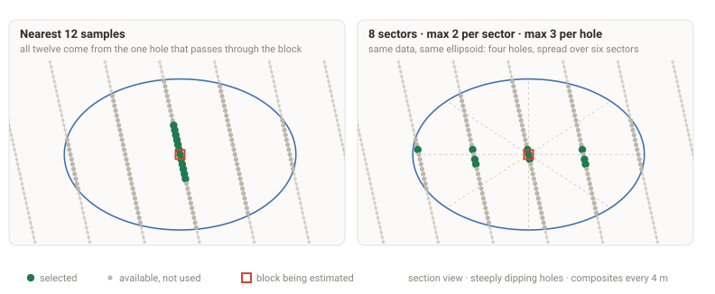
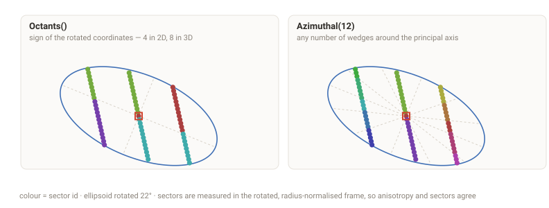
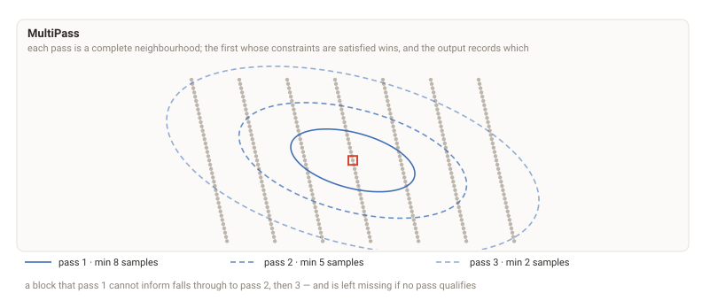

# Neighborhoods.jl

Mining-style search neighbourhoods for the [GeoStats.jl](https://github.com/JuliaEarth/GeoStats.jl)
ecosystem — anisotropic ellipsoids, angular sectors, sample quotas per sector
and per drillhole, half-space balancing, and multipass searches.

> [!WARNING]
> **Pre-release.** The design is settled and the implementation is landing
> incrementally. Every API shown below is the target, not a promise about
> today's `main`.

## Why

A block estimate is only as good as the samples that inform it. Down-hole
sampling is typically an order of magnitude denser than the spacing between
holes, so a plain "nearest N samples" search collapses onto whichever hole
happens to pass closest — a vertical string of correlated composites standing in
for a three-dimensional neighbourhood.



Both panels use the same data and the same search ellipsoid. On the left, all
twelve samples come from one hole. On the right, sector and per-hole quotas
spread the same budget across four holes and six sectors. The estimate on the
right carries information about the block; the one on the left mostly carries
information about a single drillhole.

## Sectors

Sectors are measured in the **rotated, radius-normalised frame**, so anisotropy
and sector geometry never disagree. Two conventions are available:



```julia
sectors = Octants()        # sign of the rotated coordinates: 4 in 2D, 8 in 3D
sectors = Azimuthal(12)    # any number of wedges around the principal axis
```

## Multipass

Each pass is a complete neighbourhood in its own right, not just a scaled
radius. The first pass whose constraints are satisfied wins, and the output
records which one fired.



```julia
search = MultiPass([
  SearchNeighborhood(radii=( 60, 26, 18), minsamples=8, maxsamples=16, sectors=Octants()),
  SearchNeighborhood(radii=(110, 48, 30), minsamples=5, maxsamples=16, sectors=Octants()),
  SearchNeighborhood(radii=(180, 78, 45), minsamples=2, maxsamples=16),
])
```

A block that no pass can inform is left `missing` rather than being filled with
a number nobody can defend.

## Defining a neighbourhood

```julia
using Neighborhoods
using GeoStatsBase: GslibAngles

search = SearchNeighborhood(
  radii    = (100, 50, 20),          # semi-axes of the ellipsoid
  rotation = GslibAngles(30, 0, 0),  # or Datamine / Vulcan / Minesight / Rotations.jl

  sectors      = Octants(),
  minsamples   = 4,  maxsamples   = 24,
  minpersector = 1,  maxpersector = 3,
  minsectors   = 3,

  # refuse to interpolate rather than produce an indefensible estimate
  maxemptyconsecutive = 2,

  # force samples from both sides of a plane through the block centre
  split = HalfSpace((0, 0, 1)),

  # at most 3 composites from any one hole, from at least 2 distinct holes
  category = CategoryRule(:BHID, maxper=3, mindistinct=2),
)
```

Category rules also cover hard domain boundaries and explicit per-value quotas:

```julia
category = [
  CategoryRule(:BHID, maxper=3, mindistinct=2),
  CategoryRule(:ROCK, match=:block),                    # only samples in the block's own domain
  CategoryRule(:ZONE, quotas=Dict("A" => 2:6, "B" => 0:4)),
]
```

## It works with the kriging you already have

Kriging never sees the neighbourhood — it receives a subset of samples and
solves. So this package changes *which samples go in*, and nothing else:

```julia
using GeoStats, Neighborhoods

model = Kriging(SphericalVariogram(range=120.0))

estimate = interpolate(samples, blocks, model; search)
```

`NeighborhoodSearch` is a `Meshes.BoundedNeighborSearchMethod`, so it also drops
into anything else in the ecosystem that accepts a searcher.

Every estimate can carry its own audit trail — which pass fired, how many
samples and sectors were used, and why a block was skipped:

```julia
estimate = interpolate(samples, blocks, model; search, diagnostics=true)
# ⇒ variables + :pass, :nsamples, :nsectors, :ncategories, :reject
```

## Install

Not yet registered.

```julia
using Pkg; Pkg.add(url="https://github.com/gstvschlz/Neighborhoods.jl")
```

## Development

The project uses [mise](https://mise.jdx.dev) for tooling:

```bash
mise install         # julia 1.11.9
mise run instantiate
mise run test
```

The README figures are generated, not drawn — regenerate them with:

```bash
julia assets/make_figures.jl
```

## License

MIT
